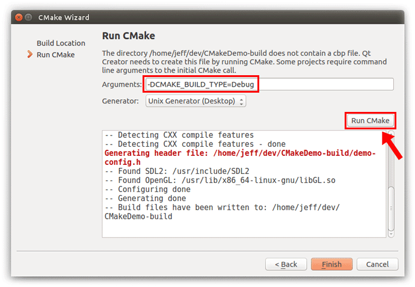

# Setup of Qt Creator for ROS
There is already an existing guide to make **Qt** and **ROS** work together but, using the **"Import Existing Project"** tool of QtCreator **may not include** all your project's libraries, and therefore the **advanced editing capabilities** of **Qt** will not be available if these files are not properly linked.

This guide will fix those problems by directly using **CMakeLists.txt**, this also has other advantage; you could use your project like a normal Qt project (no ROS).
___

<p align="center">
  <i>Most of this guide was taken from:</i><br/>
  <b>Levi Armstrong</b><br/>
  <a href="https://github.com/Levi-Armstrong/ros_qtc_plugins/wiki/Setup-Qt-Creator-for-ROS">Setup Qt Creator for ROS</a>
</p>  

___
**NOTE:** This or Armstrong's guide will not work if you are using an **old Qt version** that uses a *"CMake wizard"* when you create a project, which is shown in the following image:  
  
___
#### Table of Contents
   [1.1 Setup Ubuntu to allow debugging/ptrace](#section1.1)  
   [1.2 Adding ROS File Types](#section1.2)  
   [1.3 Configuring your *CMakeLists.txt* file](#section1.3)  
   [1.4 Opening your project using *CMakeLists.txt* in Qt](#section1.4)  
   [1.5 Setting up Build Settings for Catkin Workspace](#section1.5)  
   [1.6 Setting up Run Settings for Catkin Workspace](#section1.6)  
   [1.7 Debugging Catkin Workspace](#section1.7)  
   &nbsp; &nbsp; [1.7.1 Debugging a single file](#section1.7.1)  
   &nbsp; &nbsp; [1.7.2 Attaching to a running process (Default when working with ROS)](#section1.7.2)  
   [1.8 Opening QtCreator with ubuntu terminal](#section1.8)  
   &nbsp; &nbsp; [1.8.1 Going crazy with shortcuts](#section1.8.1)
___
<a name="section1.1"/>  

## 1.1 Setting up Ubuntu to allow debugging/ptrace
   1. Open the file:
   ```
   sudo gedit /etc/rc.local
   ```
   2. Add this line before the `exit 0` line:
   ```bash
   echo 0 | tee /proc/sys/kernel/yama/ptrace_scope
   ```
   3. Reboot your computer
   
<br/><a name="section1.2"/>

## 1.2 Adding ROS File Types
This allows Qt Creator to recognize file types like *.launch as xml for syntax highlighting and specifies that it needs to be included during the project import.
   1. Open Qt Creator
   2. Goto: <kbd>Tools</kbd> > <kbd>Options</kbd> > <kbd>Environment</kbd> > <kbd>MIME Types</kbd>
   3. The table below is a start to a list of extension to be added:

| MIME Type | Extensions |
| --------- | ---------- |
| application/xml | *.launch; *.xacro; *.urdf |
| text/plain | *.srv; *.msg|
   
<br/><a name="section1.3"/>

## 1.3 Configuring your _CMakeList.txt_ file
It is not possible to **run** _CMakeLists.txt_ in **Qt** with `catkin` libraries (`find_package(catkin REQUIRED ...)`). To avoid any error when running CMake you have to add few lines to your *CMakeLists.txt* file, the next code example shows what you have to do.
```CMake

...

if(DEFINED CATKIN_DEVEL_PREFIX)
  #––––––––––––––––––––––––––––––––––––––––––––––––––––––––––––––––––#
  #      adding all the ROS elements inside this IF conditional      #
  #––––––––––––––––––––––––––––––––––––––––––––––––––––––––––––––––––#
  ## Find catkin macros and libraries
  ## if COMPONENTS list like find_package(catkin REQUIRED COMPONENTS xyz)
  ## is used, also find other catkin packages
  find_package(catkin REQUIRED COMPONENTS
    genmsg
    message_generation
    roscpp
    rospy
    std_msgs
  )

  ## Generate messages in the 'msg' folder
  add_message_files(FILES
     some_message.msg
     other_message.msg
  )

  ## Generate added messages and services with any dependencies listed here
  generate_messages(DEPENDENCIES std_msgs)

  ###################################
  ## catkin specific configuration ##
  ###################################
  ## The catkin_package macro generates cmake config files for your package
  ## Declare things to be passed to dependent projects
  ## INCLUDE_DIRS: uncomment this if you package contains header files
  ## LIBRARIES: libraries you create in this project that dependent projects also need
  ## CATKIN_DEPENDS: catkin_packages dependent projects also need
  ## DEPENDS: system dependencies of this project that dependent projects also need
  catkin_package(
  #  INCLUDE_DIRS your_project/include
  #  LIBRARIES state_machine
     CATKIN_DEPENDS message_runtime
  #  DEPENDS system_lib
  )
endif(DEFINED CATKIN_DEVEL_PREFIX)

...

# Adding dependencies will not work because the last parameter is not going
# to be defined and you need at least 3 of them, so, you need to put it
# inside the "if(DEFINED CATKIN_DEVEL_PREFIX)" conditional.
if(DEFINED CATKIN_DEVEL_PREFIX)
  add_dependencies(${PROJECT_NAME}
    ${PROJECT_NAME}_generate_messages    # example when generating messages
    ${catkin_EXPORTED_TARGETS}
  )
endif(DEFINED CATKIN_DEVEL_PREFIX)

...

```
You can see a full example of [**CMakeLists.txt**](CMakeLists.txt) inside the files of this repository. And another example of [**CMakeLists.txt**](carmaker/CMakeLists.txt) for **CarMaker**.
   
<br/><a name="section1.4"/>

## 1.4 Opening your project using *CMakeLists.txt* in Qt
   1. Goto: <kbd>File</kbd> > <kbd>Open File or Project...</kbd>
   2. Open your project's `CMakeLists.txt` file.
   3. The *Configure project* screen will be displayed, click at <kbd>Details</kbd>
   4. It is recomendable to have only one <kbd>x</kbd> option chosen and change the folder path in the **same project folder** located at the **catkin_ws** directory. That folder will contain the simulation output's log files and ensures a correct connection between Qt, CarMaker (if used) and ROS. Do not worry about file overwriting because the executable will be located in the *devel* folder. 
   5. Click in the <kbd>Configure Project</kbd> button.
   6. If the **"Project Browser"** is not visible press: <kbd>Alt</kbd>+<kbd>0</kbd>
   
<br/><a name="section1.5"/>

## 1.5 Setting up Build Settings for Catkin Workspace
   1. First open the project, then navigate to the <kbd>Projects</kbd> > <kbd>Build Settings</kbd>
   2. Remove existing **"Build Steps"**.
   3. Add a custom build step <kbd>Add Build Step</kbd> > <kbd>Custom Process Step</kbd> as shown below.
      * Command: `catkin_make`
      * Arguments: `-DCMAKE_BUILD_TYPE=Debug`
      * Working directory: `%{buildDir}`
   4. Remove existing **"Clean Steps"**.
   5. Add a custom clean step <kbd>Add Clean Step</kbd> > <kbd>Custom Process Step</kbd> as shown below.
      * Command: `catkin_make`
      * Arguments: `clean`
      * Working directory: `%{buildDir}`
   
<br/><a name="section1.6"/>

## 1.6 Setting up Run Settings for Catkin Workspace
   1. First open the project, then navigate to the <kbd>Projects</kbd> > <kbd>Run Settings</kbd>
   2. Add a **"Run Configuration"** by selecting the <kbd>Add</kbd> > <kbd>Custom Executable</kbd>
   3. Next select the <kbd>Browse...</kbd> associated with the executable field and browse to the executable you wish to debug in the workspace *devel/lib* directory (You must have previously compiled your project using the *Terminal* and *catkin_make* command).
   4. Now everything should be setup and ready to begin debugging.
   
<br/><a name="section1.7"/>

## 1.7 Debugging Catkin Workspace
<a name="section1.7.1"/>

### 1.7.1 Debugging a single file
   1. Open a terminal and start a *roscore*
   2. Open another terminal and browse to the catkin workspace and source directory.
   3. Next open qt creator from this terminal using the command below and open project.
      * Command: `qtcreator &`
      * If the previous command does not work follow [this step](#section1.8).
   4. Now from the terminal launch the project you wish to debug. (optional: if using launch file)
   5. Next in qt creator browse to the file you wish to debug and insert break points.
   6. Now select the start debugger button. 
      * Note: If you are using launch file this will kill the currently running executable generated from step 4 and start a new one.
   7. Now depending on where the break points were placed qt should be stopped at a break point.
<a name="section1.7.2"/>

### 1.7.2 Attaching to a running process (Default when working with ROS)
   1. Open a terminal and browse to the catkin workspace and source directory.
   2. Next open qt creator from this terminal using the command below and open project.
      * Command: `qtcreator &`
      * If the previous command does not work follow [this step](#section1.8).
   3. Now from the terminal launch the project you wish to debug. (optional: if using launch file)
   4. Next in Qt Creator browse to the file you wish to debug and insert break points.
   5. <kbd>Menu Bar</kbd> > <kbd>Debug</kbd> > <kbd>Start Debugging</kbd> > <kbd>Attach to Running Process</kbd>
   6. Now select the Process ID and then click the button <kbd>Attach to Process</kbd>. 
   7. Now depending on where the breakpoints were placed in qt, it should be stopped at a break point when it reaches one.
      * Note: Sometime it will be paused at a ros::spin, so check after it has attached and if it is passed and not at a inserted breakpoint click the continue button in the debugger.

<br/><a name="section1.8"/>
   
## 1.8 Opening QtCreator with ubuntu terminal
If you have opened an *ubuntu terminal*, runned the `qtcreator &` command and received the message `qtcreator: command not found` you have to follow the next steps to get it working:
   1. run the command: `gedit ~/.bash_aliases`
   2. Add the line below and do not forget to change `<qt folder>` to the Qt folder's path:
   ```bash
   alias qtcreator='<qt folder>/Tools/QtCreator/bin/qtcreator'
   ```
   3. run `source ~/.bashrc` in the terminal
   4. Everything is ready to use the `qtcreator &` command.
<a name="section1.8.1"/>

### 1.8.1 Going crazy with shortcuts
You could add more shortcuts for the Ubuntu terminal, some examples:
   * Adding a shortcut to **catkin_ws** folder (assuming *~/catkin_ws/* is your current catkin folder)
   ```bash
   alias catkin='cd ~/catkin_ws/; source devel/setup.bash;'
   ```
   * Adding a shortcut to your **catkin_ws** project:
   ```bash
   alias my_project='cd ~/catkin_ws/src/my_project_folder; source ../../devel/setup.bash;'
   ```
   * Adding a shortcut to open **QtCreator** and **catkin_ws'** folder together (`qtcreator &` must be working already):
   ```bash
   alias qt_catkin='cd ~/catkin_ws/; source devel/setup.bash; qtcreator &'
   ```
   
